Consultoría de Bancos

[**Bases de Datos...................................................................................................................... 2** ](#_page1_x72.00_y618.61)[Enunciado.........................................................................................................................2** ](#_page1_x72.00_y671.06)[Diseño conceptual........................................................................................................... 4** ](#_page3_x72.00_y72.00)[Diseño lógico....................................................................................................................4** ](#_page3_x72.00_y477.64)[Entidades..................................................................................................................... 4 ](#_page3_x72.00_y522.79)[Relaciones N:M o N:M:P..............................................................................................5 ](#_page4_x72.00_y284.19)[Normalización...............................................................................................................5 ](#_page4_x72.00_y383.39)[**Diseño en MySQL Workbench........................................................................................6** ](#_page5_x72.00_y345.95)[Consultas..................................................................................................................... 9 ](#_page8_x72.00_y72.00)[**Microsoft Access............................................................................................................14** ](#_page13_x72.00_y223.46)[Importación de los datos............................................................................................ 14 ](#_page13_x72.00_y362.50)[Subformularios........................................................................................................... 17 ](#_page16_x72.00_y156.68)[**MongoDB........................................................................................................................ 20** ](#_page19_x72.00_y72.00)[Paso de tablas a NoSQL............................................................................................20 ](#_page19_x72.00_y128.25)[Banco................................................................................................................... 21 ](#_page20_x72.00_y72.00)[Pais.......................................................................................................................21 ](#_page20_x72.00_y362.19)[Cuenta..................................................................................................................21 ](#_page20_x72.00_y683.33)[Cliente.................................................................................................................. 22 ](#_page21_x72.00_y484.65)[Empleado............................................................................................................. 23 ](#_page22_x72.00_y72.00)[Consultas................................................................................................................... 23 ](#_page22_x72.00_y506.15)[**Página web........................................................................................................................... 34** ](#_page33_x72.00_y72.00)[HTML................................................................................................................................35 ](#_page34_x72.00_y362.92)[CSS..................................................................................................................................36 ](#_page35_x72.00_y711.96)[JavaScript mouseover......................................................................................................39 ](#_page38_x72.00_y354.77)[Párrafo........................................................................................................................39 ](#_page38_x72.00_y443.57)[Imágenes....................................................................................................................39](#_page38_x72.00_y583.91)

[JS sugerencias.................................................................................................................41 ](#_page40_x72.00_y72.00)[Posible mejora............................................................................................................43 ](#_page42_x72.00_y355.77)[Consultas......................................................................................................................... 43 ](#_page42_x72.00_y437.92)[Consulta_nombres..................................................................................................... 43 ](#_page42_x72.00_y483.08)[Consulta_transacciones.............................................................................................44 ](#_page46_x72.00_y336.48)[Insertar, eliminar datos...............................................................................................44 ](#_page50_x72.00_y72.00)[Problema surgido de array de arrays...................................................................44 ](#_page50_x72.00_y181.79)Consulta SQL complicada..........................................................................................46

Bases de Datos

Enunciado

BankingConsulting quiere una base de datos en la que almacena la información relativa a bancos.

- Los bancos operan en países.
- Los países usan una única divisa.
- Una divisa puede ser compartida por varios países, por ejemplo el euro.
- Los clientes pueden tener varias cuentas bancarias y las cuentas bancarias pueden ser compartidas por varios clientes.
- Una cuenta está en un único banco.
- Se realizan transacciones en una divisa determinada
- Dichas transacciones tienen una única cuenta asociada
  - Cuando dos clientes se mandan dinero se generan dos transacciones, una de recibir dinero (cantidad de dinero positiva) y otra de mandar dinero (cantidad de dinero negativa)
- Los clientes piden préstamos a los bancos.
  - Un préstamo es pedido por una persona a un banco determinado.
- Los bancos tienen empleados. Estos empleados se dividen en supervisores y miembros de equipo. Un supervisor tiene varios miembros de equipo, pero un miembro de equipo es supervisado por un único supervisor.

De un país se desea guardar su Nombre y Población y un ID.

De los bancos su sede, nombre e ID.

De las divisas la tasa de cambio e ID.

De las cuentas sus balances, tipo (depósito o cuenta corriente) e iD.

De las transacciones la fecha, cantidad, descripción e ID.

De los préstamos la cantidad, fecha inicio, fecha vencimiento e ID.

De los empleados su nombre, apellido e ID.

Diseño conceptual

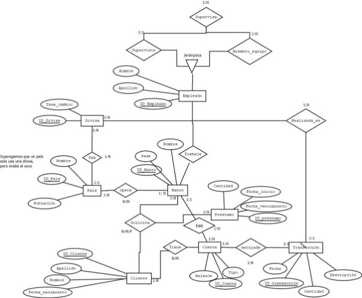

Diseño lógico

Entidades

Subrayado indica que dicho atributo(s) es(son) “Primary Key”

1. País (ID\_País, Nombre, Población,*ID\_Divisa*)
   1. FK: ID\_Divisa -> Divisa
1. Banco (ID\_Banco, Nombre, Sede)
1. Préstamo (ID\_Préstamo, Monto, Fecha\_inicio, Fecha\_vencimiento)
1. Cliente (ID\_Cliente, Nombre, Apellido, Fecha\_nacimiento)
1. Cuenta (ID\_Cuenta, Tipo, Balance, *ID\_Banco*)
   1. FK: ID\_Banco -> Banco
1. Transacción (ID\_Transacción, Fecha, Monto, Descripción,*ID\_Divisa*, *ID\_Cuenta*)
1. FK: ID\_Divisa -> Divisa
1. FK: ID\_Cuenta
7. Divisa (ID\_Divisa, Código, Tasa\_cambio)
7. Empleado (ID\_Empleado, Nombre, Apellido, *ID\_Banco*)
7. Supervisor(ID\_Supervisor, *ID\_Empleado*)

a. FK: ID\_Empleado -> Empleado

10\.Miembro\_Equipo(ID\_Miembro\_Equipo, *ID\_Empleado*, *ID\_Supervisor*)

1. FK: ID\_Empleado -> Empleado
1. FK: ID\_Supervisor -> Supervisor

En Divisa el código podría haber sido “Primary Key” y en Supervisor y Miembro\_Equipo el ID\_Empleado podría haber funcionado como “Primary Key”, sin embargo, prefiero añadir nuevos IDs por guardar la consistencia con el resto de entidades.

Relaciones N:M o N:M:P

1. opera(ID\_País, ID\_Banco)
1. solicita (ID\_Banco,ID\_Prestamo,ID\_Cliente)
1. tiene(ID\_Cliente,ID\_Cuenta)

Normalización

Vamos a estudiar si el esquema lógico está en 3FN. Primero, usando la definición de clase de 1FN:

*“Una tabla relacional R está en primera forma normal (1FN) si NO contiene campos multivaluados (cada atributo 1 valor).”*

Como nuestro diseño no tiene campo multievaludados, concluimos que está en 1FN.

Para ver si está en 2FN es necesario que esté en 1FN y, además, que no exista dependencia transitiva entre campos no principales y claves candidatas.

- País (ID\_País, Nombre, Población,*ID\_Divisa*)
  - No hay atributos dependiente ID\_Pais (única clave candidata)
- Banco (ID\_Banco, Nombre, Sede)
  - No hay atributos parciales dependientes de la clave (ID\_Banco).
- Préstamo (ID\_Préstamo, Monto, Fecha\_inicio, Fecha\_vencimiento)
  - No hay atributos parciales dependientes de la clave (ID\_Préstamo)
- Cliente (ID\_Cliente, Nombre, Apellido, Fecha\_nacimiento)
  - No hay atributos parciales dependientes de la clave (ID\_Cliente)
- Cuenta (ID\_Cuenta, Tipo, Balance, *ID\_Banco*)
- No hay atributos parciales dependientes de la clave (ID\_Cuenta)
- Transacción (ID\_Transacción, Fecha, Monto, Descripción,*ID\_Divisa*, *ID\_Cuenta*)
  - No hay atributos parciales dependientes de la clave (ID\_Transacción)
- Divisa (ID\_Divisa, Código, Tasa\_cambio)
  - No hay atributos parciales dependientes de la claves candidatas (ID\_Divisa y Código)
- Empleado (ID\_Empleado, Nombre, Apellido, *ID\_Banco*)
  - no hay atributos parciales dependientes de la clave (ID\_Empleado)
- Supervisor(ID\_Supervisor, *ID\_Empleado*)
  - no hay atributos parciales dependientes de claves candidatas (ID\_Supervisor e ID\_Empleado)
- Miembro\_Equipo(ID\_Miembro\_Equipo, *ID\_Empleado*, *ID\_Supervisor*)
- no hay atributos parciales dependientes de claves candidatas (ID\_Miembro\_Equipo e ID\_Empleado)

Luego todas las tablas están en 2FN

Y no hay dependencias transitivas, luego, como es 2FN, también es 3FN.

Diseño en MySQL Workbench

Primero he generado los archivos SQL:

- [economiaDB.sql](https://github.com/danmorper/trabajo-base-datos/blob/main/BD/economia.sql) (diseño de tablas)
- [economia_insert.sql](https://github.com/danmorper/trabajo-base-datos/blob/main/BD/economia_insert.sql) (inserción de datos)

He usado la herramienta de “reverse engineering” para hacer el diseño lógico en MySQL Workbench.

1. Hacemos click en “Create EER Model from Script”:

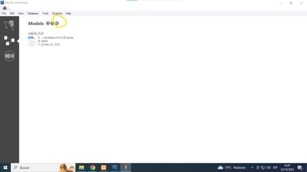

2. Añadimos el Script SQL donde se crean las tablas, seleccionamos “Place imported objects on a diagram” y le damos a “Execute”, luego “Next” y luego “Finish”.

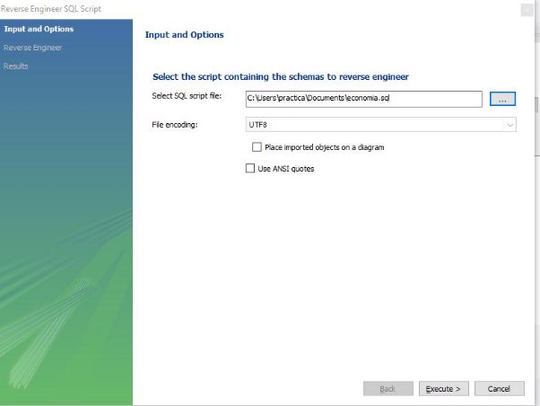

Obtenemos el diagrama lógico

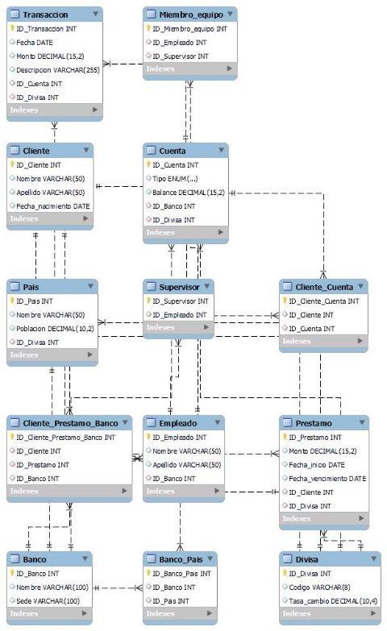

Archivo del modelo de MySQL workbench:

- [EconomiaDB.mwb](https://github.com/danmorper/trabajo-base-datos/blob/main/BD/reverse_engineering/EconomiaDB.mwb)

Consultas

Las consultas están en el archivo [queries.sql](https://github.com/danmorper/trabajo-base-datos/blob/main/BD/queries.sql)

1. clientes que hayan nacido después de 1960

SELECT \* FROM Cliente WHERE Fecha\_Nacimiento > '1960-12-31';![ref1]

2. clientes cuyos nombres empiecen por D

SELECT \* FROM Cliente WHERE Nombre LIKE 'D%';![ref2]

3. clientes que tengan más de 2 cuentas

SELECT Nombre

FROM Cliente WHERE ID\_Cliente IN

(SELECT ID\_Cliente FROM Cliente\_Cuenta GROUP BY ID\_Cliente

HAVING COUNT(ID\_Cuenta) > 1);

4. ids de los clientes que tengan cuenta en el Banco Bilbao y Deutsche Bank

SELECT ID\_Cliente

FROM Cliente\_Banco WHERE ID\_Banco IN (SELECT ID\_Banco FROM Banco WHERE Nombre IN ('Banco Bilbao', 'Deutsche Bank'));

5. id de los clientes cuya posicion neta (suma de balances de sus cuentas) sea negativa

SELECT ID\_Cliente, Nombre

FROM Cliente WHERE ID\_Cliente IN

(SELECT ID\_Cliente FROM Cuenta

INNER JOIN Cliente\_Cuenta ON Cuenta.ID\_Cuenta = Cliente\_Cuenta.ID\_Cuenta GROUP BY ID\_Cliente HAVING SUM(Balance) < 0);

6. ids de las transacciones que se hagan a una cuenta con divisa distinta a la propia de la transacción

SELECT ID\_Transaccion FROM Transaccion![ref3]

INNER JOIN Cuenta ON Transaccion.ID\_Cuenta = Cuenta.ID\_Cuenta WHERE Transaccion.ID\_Divisa != Cuenta.ID\_Divisa;

7. cantidad a ingresar en la divisa de la cuenta de las transacciones que tienen una divisa distinta a la de la cuenta

SELECT Transaccion.Monto \* D1.Tasa\_cambio\*1/D2.Tasa\_cambio

FROM Transaccion

-- Join de la tabla de transacciones con la tabla de cuentas

INNER JOIN Cuenta ON Transaccion.ID\_Cuenta = Cuenta.ID\_Cuenta

-- Hago el JOIN para obtener Tasa de cambio de la moneda de la transacción INNER JOIN Divisa as D1 ON Transaccion.ID\_Divisa = D1.ID\_Divisa

-- Hago el JOIN para obtener Tasa de cambio de la moneda de la cuenta INNER JOIN Divisa as D2 ON Cuenta.ID\_Divisa = D2.ID\_Divisa

WHERE Transaccion.ID\_Divisa != Cuenta.ID\_Divisa;

8. Mostar el nombre de los clientes que tenga alguna cuenta con divisa distinta a euros

SELECT Nombre FROM Cliente WHERE ID\_Cliente IN

(SELECT ID\_Cliente FROM Cliente\_Cuenta WHERE ID\_Cuenta IN (SELECT ID\_Cuenta FROM Cuenta WHERE ID\_Divisa != 1));

9. Mostrar los paises que no tengan mas de 2 bancos SELECT ID\_Pais FROM Banco\_Pais

GROUP BY ID\_Pais HAVING COUNT(ID\_Banco) <= 2;

10. Mostrar las divisas que no tengan ninguna cuenta asociada

SELECT \* FROM Divisa

WHERE ID\_Divisa NOT IN (SELECT ID\_Divisa FROM Cuenta);

11. Mostrar las divisas que se usen en menos de dos paises

SELECT ID\_Divisa FROM Pais

GROUP BY ID\_Divisa HAVING COUNT(ID\_Pais) < 2;

AÑADIR FOTO

12. Mostrar los prestamos que tengan una durancion mayor a 10 años

SELECT \* FROM Prestamo WHERE DATEDIFF(Fecha\_fin, Fecha\_inicio) > 365\*10;

13. Mostrar los clientes que tengan un prestamo con una duracion mayor a 10 años

SELECT ID\_Cliente FROM Prestamo

WHERE DATEDIFF(Fecha\_fin, Fecha\_inicio) > 365\*10;

14. Mostrar los clientes que tengan un prestamo en un banco en el que no tienen ninguna cuenta

SELECT Cliente\_Prestamo\_Banco.ID\_Cliente FROM Cliente\_Prestamo\_Banco INNER JOIN Cliente\_Banco

ON Cliente\_Prestamo\_Banco.ID\_Cliente = Cliente\_Banco.ID\_Cliente

WHERE Cliente\_Prestamo\_Banco.ID\_Banco != Cliente\_Banco.ID\_Banco;

15. Mostrar las divisas con las que hay una cantidad transferida total equivalente a más de 500 euros

SELECT Transaccion.Monto\*Divisa.Tasa\_cambio, Transaccion.\* FROM Transaccion![ref3]

INNER JOIN Divisa ON Transaccion.ID\_Divisa = Divisa.ID\_Divisa;

16. Comprobar si las cuentas asociadas que tenga el cliente está él sólo y si es así borrar la cuenta también.

Usado en [Problema surgido de array de arrays](#_page50_x72.00_y181.79)

SELECT ID\_Cuenta FROM Cliente\_Cuenta WHERE ID\_Cuenta IN

(SELECT ID\_Cuenta

FROM Cliente\_Cuenta

GROUP BY ID\_Cuenta

HAVING COUNT(\*) = 1)

AND ID\_Cliente = 1

Microsoft Access

Vídeos útiles:

- [Como crear Bases de Datos en Access](https://youtu.be/5iopgBPbU50?si=QaTJGAq5wIXUtetA)
- [Como crear Formularios en Access](https://youtu.be/ynb7xkTyaSQ?si=pFkpatdQYotHsRn9)
- [FORMULARIOS con SUBFORMULARIOS 📰 Base de Datos en ACCESS (Pa…](https://www.youtube.com/watch?v=FDm-wKT4Kio)
- [» Como CREAR UN FORMULARIO en Access con BOTONES 🔘 🔳 03](https://www.youtube.com/watch?v=9RsaUPrn544)

Importación de los datos

Exportamos los datos de phpmyadmin seleccionando la tabla que queramos exportar y los datos de la tabla que deseemos y haciendo click sobre export. Además escogemos el formato “CSV for MS Excel”.

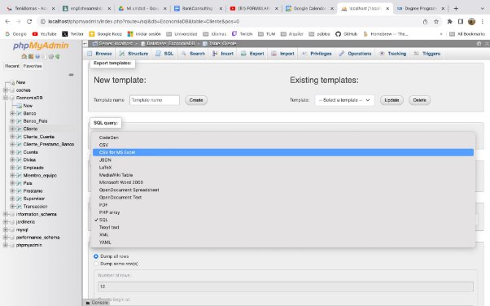

Luego en la foto pinchamos en Archivo de texto

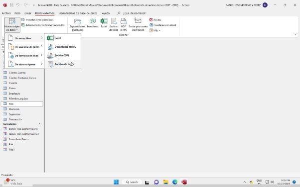

En examinar escogemos el archivo csv que hemos exportamos y en la imagen siguiente vemos dónde escogemos la tabla donde queremos importar los datos pulsamos aceptar y acabamos.

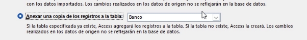

Subformularios

Son útiles para mostrar datos de tablas con relaciones N:M. Por ejemplo, vamos a crear un formulario para mostrar los bancos que operan en un determinado país.

Primero pinchamos en *Asistente para formularios*.

Luego elegimos los campos que queremos que se muestren de cada tabla.

- Banco: Nombre y sede
- Banco\_Pais: ID\_Banco, ID\_Pais
- Pais: Nombre

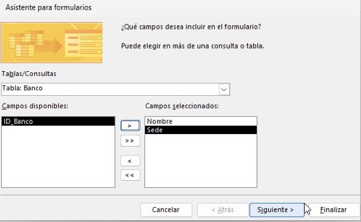

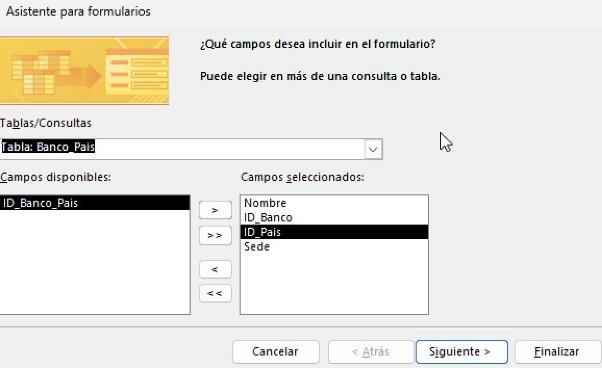

Por último, elegimos agrupar los bancos por país.

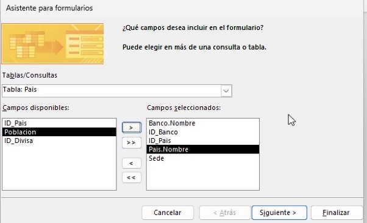

Pinchamos en *ver* para ir a *vista de diseño*. Pinchamos sobre botones. Elegimos un botón para navegar a anterior y siguiente registro.

Nos queda el formulario con subformulario tal que así:

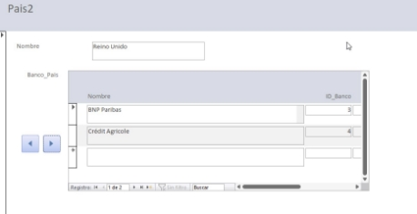

MongoDB

Primero hay que adaptar la parte del modelo entidad relación a colecciones (NoSQL). En la siguiente imagen se puede ver en verde la parte del modelo que voy a adaptar.

Paso de tablas a NoSQL

Banco

Colección con Nombre, Sede, ID (los genera automáticamente Mongo DB) y para conservar la relación entre País y Banco creo una colección con un array con los IDs de Pais.

Pais

Nombre, Poblacion y colección llamada Divisa con Código y Tasa de Cambio.

Cuenta

Divisa como subcolección y relación con Cliente mediante array de códigos.

Cliente

Empleado

Para adaptar la relación jerárquica vamos a poner un campo Supervisor\_ID, que será null para los supervisores (no son supervisados por nadie) pero cuando sea un miembro de un equipo (no supervisor) tendrá el ID del supervisor asignado.

Los archivos JSON anteriores se encuentran en github:

- [Banco.json](https://github.com/danmorper/trabajo-base-datos/blob/main/BD/MongoDB/Banco.json)
- [Cliente.json](https://github.com/danmorper/trabajo-base-datos/blob/main/BD/MongoDB/Cliente.json)
- [Cuenta.json](https://github.com/danmorper/trabajo-base-datos/blob/main/BD/MongoDB/Cuenta.json)
- [Empleado.json](https://github.com/danmorper/trabajo-base-datos/blob/main/BD/MongoDB/Empleado.json)
- [Pais.json](https://github.com/danmorper/trabajo-base-datos/blob/main/BD/MongoDB/Pais.json)

Consultas

Las consultas siguientes se encuentran en el siguiente fichero [consultas.txt](https://github.com/danmorper/trabajo-base-datos/blob/main/BD/MongoDB/consultas.txt)

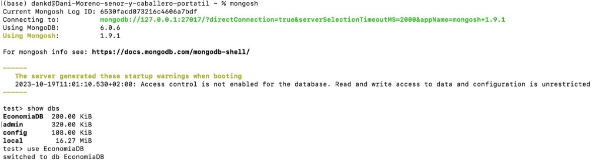

1. Obtener todos los bancos con sede en "Londres" EconomiaDB.Banco.find({ "Sede": "Londres" })

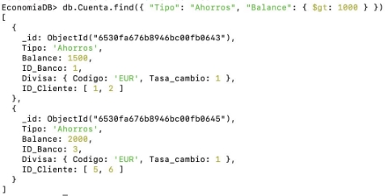

2. Encontrar todas las cuentas de ahorro con un saldo mayor de 1000 euros db.Cuenta.find({ "Tipo": "Ahorros", "Balance": { $gt: 1000 } })

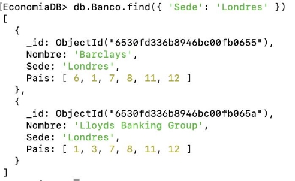

3. Buscar empleados que trabajen en un banco con sede en "Londres" db.Empleado.find({ "ID\_Banco": { $in: [2, 7] } })

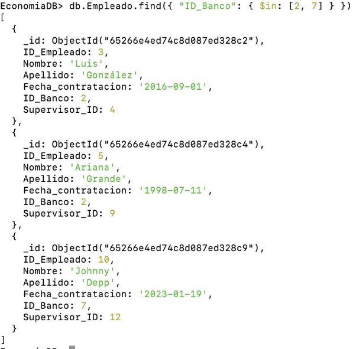

4. Encontrar todos los clientes cuyo nombre sea "Juan" db.Cliente.find({ "Nombre": "Juan" })![ref4]

5. Obtener la población de todos los países con una población mayor de 50 millones de habitantes

db.Pais.find({ "Poblacion": { $gt: 50 } })![ref1]

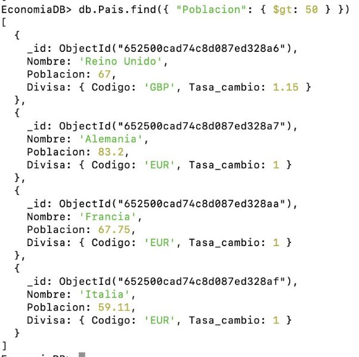

6. Encontrar todas las cuentas en euros (EUR) con un saldo mayor de 1000 euros db.Cuenta.find({ "Divisa.Codigo": "EUR", "Balance": { $gt: 1000 } })![ref4]

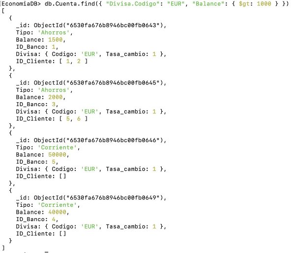

7. Encontrar todos los empleados que no tienen supervisor, es decir, los supervisores. db.Empleado.find({ "Supervisor\_ID": null })![ref4]

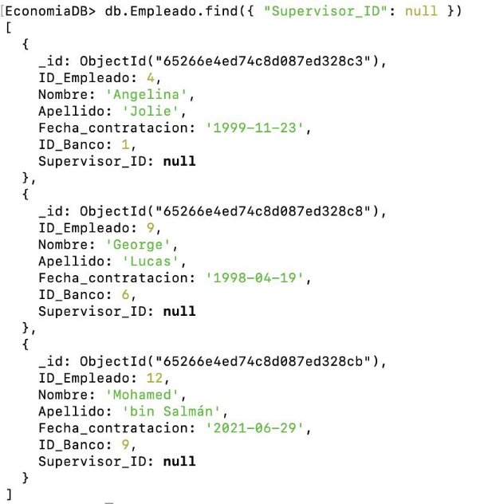

8. Encontrar los bancos que operan en más de 5 países db.Banco.aggregate([

{

$project: {

Nombre: 1,

Sede: 1,

NumPaises: { $size: "$Pais" }

}

}, {

$match: {

NumPaises: { $gt: 5 }

}

}

]) ó

db.Banco.find({

$where: "this.Pais.length > 5" })

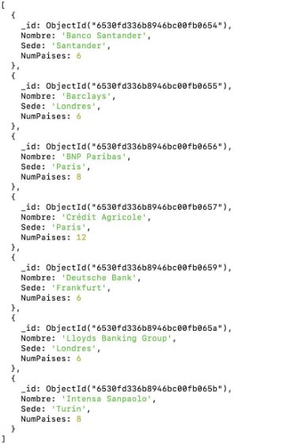

9. Obtener el nombre y apellido de los empleados que trabajan en el banco con ID 1 db.Empleado.find({ "ID\_Banco": 1 }, { "Nombre": 1, "Apellido": 1 })![ref4]

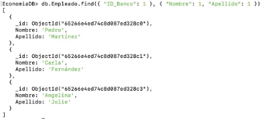

10. Encontrar las cuentas de ahorro con un saldo negativo db.Cuenta.find({ "Tipo": "Ahorros", "Balance": { $lt: 0 } })![ref2]

CORREGIR

11. Encontrar las cuentas de ahorro con un saldo negativo

db.Cuenta.find({ "Tipo": "Ahorros", "Balance": { $lt: 0 } })

12. Encuentra los tres bancos con el mayor número de sucursales (países en los que operan)

db.Banco.aggregate([

{ $project: { "Nombre": 1, "Numero\_Paises": { $size: "$Pais" } } }, { $sort: { "Numero\_Paises": -1 } },

{ $limit: 3 }

])

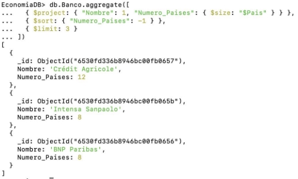

13. Encuentra el cliente más joven db.Cliente.aggregate([

{

$project: {

"Nombre": 1,

"Apellido": 1,

"Fecha\_nacimiento": { $toDate: "$Fecha\_nacimiento" },

"Edad": {

$floor: {

$divide: [

{ $subtract: [new Date(), { $toDate: "$Fecha\_nacimiento" }] }, 31536000000 // Milisegundos en un año

]

}

}

}

},

{ $sort: { "Edad": 1 } },

{ $limit: 1 }

])

14. Encuentra el saldo total de todas las cuentas en euros (EUR) para cada banco

db.Cuenta.aggregate([

{ $match: { "Divisa.Codigo": "EUR" } }, {

$group: {

\_id: "$ID\_Banco",

Saldo\_Total: { $sum: "$Balance" }

}

}

])

15. Encuentra la edad promedio de los empleados en el banco con ID 1

db.Empleado.aggregate([

{

$match: { "ID\_Banco": 1 }

},

{

$project: {

"Fecha\_contratacion": { $toDate: "$Fecha\_contratacion" }, "Edad": {

$floor: {

$divide: [

{ $subtract: [new Date(), { $toDate: "$Fecha\_contratacion" }] }, 31536000000 // Milisegundos en un año

]

}

}

}

}, {

$group: {

\_id: null,

EdadPromedio: { $avg: "$Edad" } }

}

])

16. Encuentra los clientes que no tienen cuentas en ningún banco.

db.Cliente.find({

"ID\_Cliente": { $nin: db.Cuenta.distinct("ID\_Cliente") } })

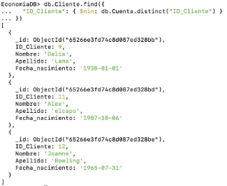

Página web

Bankconsulting nos ha pedido diseñar una página web en la que puedan describir la empresa y su filosofía. Además, quieren poder filtrar los nombres de los clientes por su nombre y/o apellidos y ver la consultas más nuevas de una fecha dada y una divisa seleccionada.

Se puede visitar la web en github: <https://danmorper.github.io/> pero no tiene la parte de servidor.

Primero creamos el archivo [index.html](https://github.com/danmorper/trabajo-base-datos/blob/main/web/index.html). Luce tal que así:

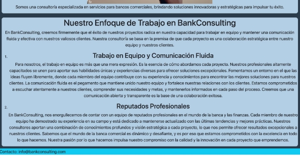

He usado bootstrap5 para estructurar la página.

Se compone de una barra de navegación fija en la parte de arriba de la pantalla y de una parte inferior que cambia según donde pulses en la barra de navegación.

Si pinchas en “sobre nosotros” ves una breve descripción de lo que es BankConsulting (por defecto cuando abres la web).

Si pinchas sobre “Consulta nombres” te aparece un formulario en el que escribes nombre y/o apellidos de el/los cliente/s que quieres filtrar. Al pinchar sobre “Enviar” te aparecen los clientes que cuadran con la búsqueda en la tabla inferior.

Si pinchas sobre “Consulta transacciones” te aparecen 3 columnas.

- En la de la izquierda introduces la fecha a partir de la cual quieres ver transacciones. Por ejemplo, si introduces el 1 de Enero de 2020, te saldrán transacciones más recientes de dicha fecha, es decir, una transacción que se hizo el 4 de Abril de 2021 podría aparecer.
- En la columna central aparecen diferentes divisas. Sólo apareceran las transacciones realizadas en las divisas que estén seleccionadas.
- En la columna de la derecha aparecen dos botones.
- Enviar: hacer la búsqueda de las transacciones
- Reset: restablecer todos los valores al predeterminado.

HTML

Barra de Navegación de bootstrap5:

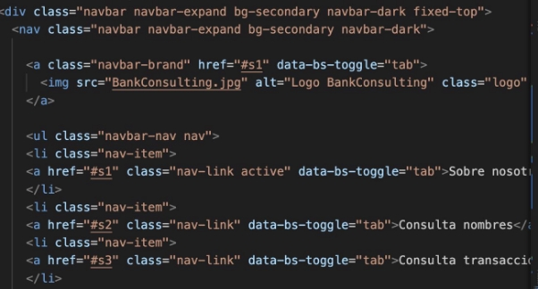

Contenido de las diferentes secciones de la barra de navegación:

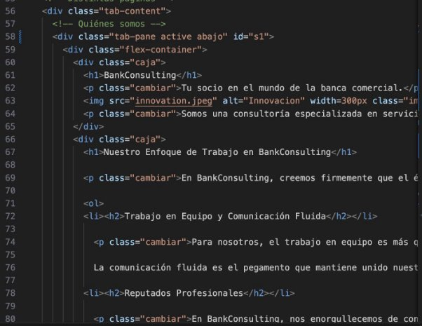

La web tiene un footer con el contacto

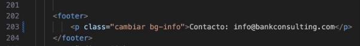

En el head del html hemos añadido la hoja de estilos de bootstrap y una creada por mí, [style.css](https://github.com/danmorper/trabajo-base-datos/blob/main/web/style.css)

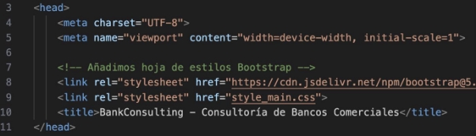

CSS

- flex-container:
- flex-direction column, hace que los div siguientes (en este caso todos tienen clase “caja”) aparezcan uno debajo de otro

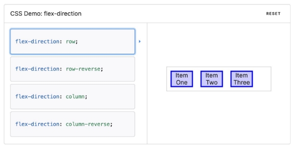

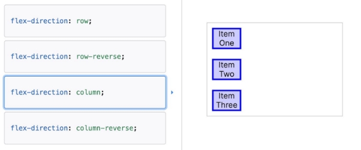

*fuente: [https://developer.mozilla.org/en-US/docs/Web/CSS/flex-direction*](https://developer.mozilla.org/en-US/docs/Web/CSS/flex-direction)*

- caja
- img
  - edita tamaño imagenes
- logo
  - edita el tamaño, lo creé específicamente para el logo de la barra de navegación
- cambiar
  - Te hace la letra más grande
- nuevaClase
  - se usa en js
- nuevaClase2
- se usa en js
- abajo
- Hace el margen superior más grande para desplazar el contenido hacia abajo y que no lo tape la barra de navegación

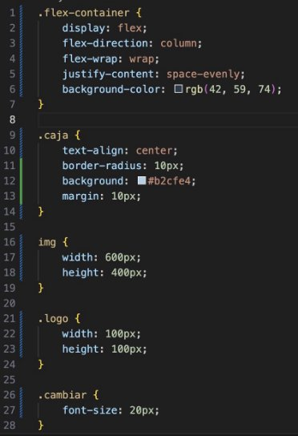

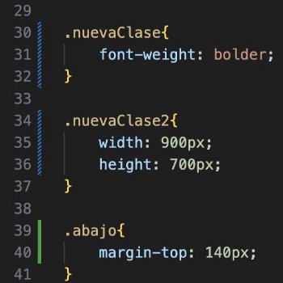

JavaScript mouseover

Quiero que cuando pase el ratón por encima de:

1. un párrafo, la letra se ponga en negrita
1. una imagen, se haga más grande

Párrafo

Seleccionamos todos los párrafos que tienen la clase “cambiar” (los tienen todos, lo he puesto yo). Lo guardamos en variable parrafos.

con forEach hacemos dos event listener:

- mouseover -> cuando pasemos el ratón por encima añade la clase de css “nuevaClase”
- mouseout -> cuando quitemos el ratón de encima quita la clase de css “nuevaClase”

Imágenes

Sigue el mismo principio, pero con nuevaClase2 y se seleccionan las imágenes.

JS sugerencias

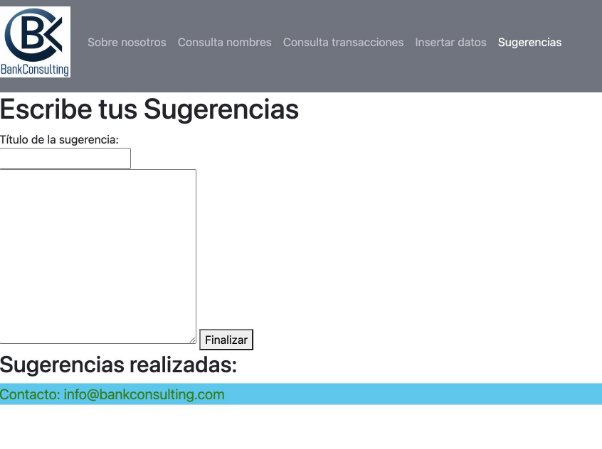

Hay un input text para escribir título de la sugerencia y textarea para escribir la sugerencia. Al pinchar sobre “Finalizar” se añade lo que se haya escrito después de “Sugerencias realizadas”. El título se mostrará pero la sugerencia estará oculta.

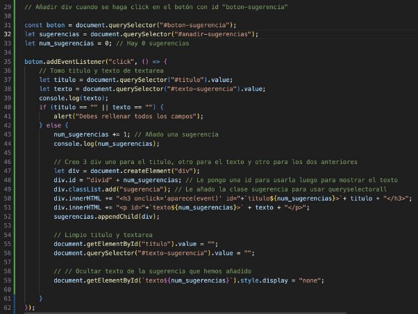

Cuando pincho sobre botón primero veo si no se ha añadido nada como título o sugerencia, en caso afirmativo saco alerta y NO CAMBIO num\_sugerencias.

Si tengo titulo Y sugerencia, creo un elemento div que va a tener como hijos al título, con etiqueta h3, y texto de la sugerencia, con etiqueta p (que lo oculto al final).

Posteriormente, dejo en blanco el input y el textarea.

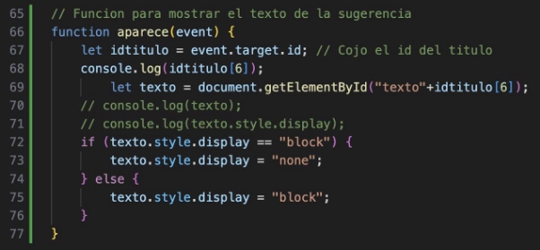

Para mostrarlo añadí una función aparece un observador(?) de eventos “onclick” como se ve en la siguiente foto:

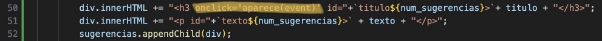

Defino la función *aparece* que recibe el evento. uso .target para obtener el elemento que “sufre(?)” el evento, en este caso el h3. Tomo su id y lo guardo en la variable *texto*.

La id del h3 y del texto contienen el mismo número luego puedo acceder al texto que corresponde al h3 sobre el que he pinchado fácilmente.

Si está en style.display tiene el valor “block”, entonces se está mostrando, luego lo oculto dándole el valor “none”. En caso contrario,es decir, tiene el valor “none”, significa que no se está mostrando, luego le doy valor “block” para que sí se muestre.

Decidí hacerlo con *<h3 onclick=aparece(event)>* porque tuve el problema de que los párrafos se añaden de manera dinámica. Entonces si hace un queryselector, como se carga cuando se carga la página los elementos que quiero aún no existen. Con la solución de poner *<h3 onclick=aparece(event)>* hace que como envía el evento puedo recibir el elemento HTML h3 mediante .target. Win for me 🙂.

En esta sección no he añadido lo de cambiar la clase css al pasar el ratón por encima el ratón para no complicar más la cosa.

Posible mejora

Hacer una base de datos en la que guarde las sugerencias para que cuando se cierre el navegador no se pierdan.

Además, añadir la funcionalidad de eliminar sugerencias.

Consultas

Consulta\_nombres

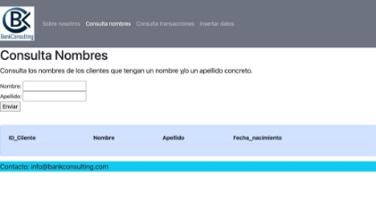

Introduces nombre y/o apellidos y en la tabla azul te salen los registros que concuerden.

Tomo el formulario en la variable *formulario* y espero que suceda el evento *“submit”* para aplicar una función. Primero, uso *preventDefault* para evitar que el navegador me lleve al documento php. Luego, tomo los datos del formulario con new FormData (en consola se puede ver las propiedades de dicho objeto).

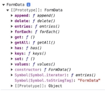

Hago una consulta mediante el método “POST” a *consulta\_nombres.php* (el fetch).

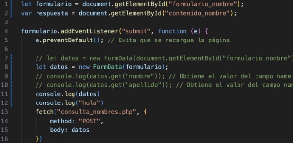

El php recibe nombre y apellido y lo guarda en variables, establece la conexión mediante new PDO. Si el intento de conexión falla se devuelve “Error: (mensaje de error)”.

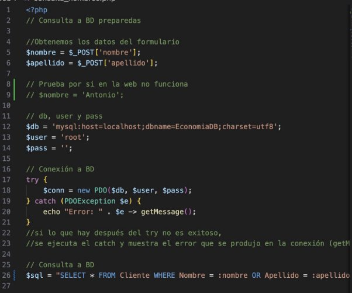

Hago la consulta preparada (uso *:algo* y *bindParam* en vez de poner directamente $algo en la consulta). *fetchAll* se usa para pasar de un array con subarrays (cada fila de datos de la consulta es un subarray) a un array asociativo.

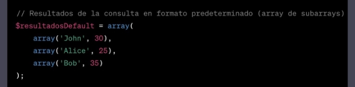

ejemplo array predeterminado

ejemplo array asociativo

[eb](#_page33_x72.00_y72.00).

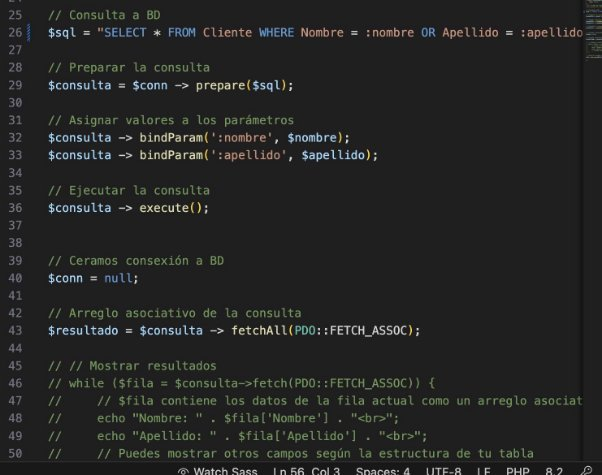

Hago json\_encode y el echo.

Vuelvo al JS.

- El primer .then es una arrow function que espera tiene un argumento (res) al que se le aplica la función json que toma un documento en formato json y lo transforma a un objeto válido en JS.
- El siguiente .then
1. Se borra la tabla en la que se visualizan los datos en el HTML, para que podamos visualizar la nueva consulta.
1. Si la respuesta de la consulta no es vacía se añade una fila en la tabla del HTML por cada documento (fila de la consulta) del JSON.

Si la respuesta es vacía se colapsan las columnas y se hace sólo una fila con el mensaje “No se encontraron resultados”

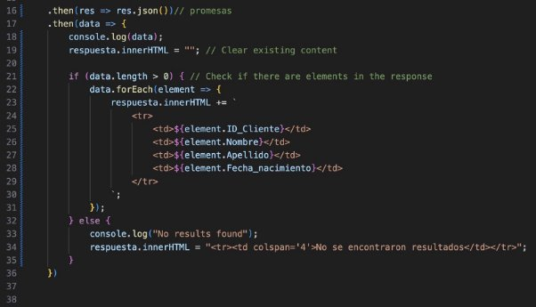

Consulta\_transacciones

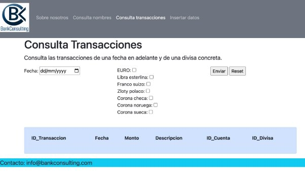

De qué trata explicado en [Página web](#_page33_x72.00_y72.00).

Procedemos de manera parecida a consulta\_nombres co el *addEventListener.* Tomamos en divisaSeleccionada todas las divisas que han sido seleccionadas. divisaSeleccionada es un nodeList, que aunque es un objeto parecido a un Array no lo es, así que lo convertimos en un array con Array.fromy lo guardamos en divisaSeleccionada2.

La consulta que vamos a hacer es mediante el método get. Sería más apropiado hacerlo mediante el método post, ya que tenemos una array, pero vamos a tomarlo como un reto. Para solucionar el problema iteramos en el array y hacemos varias consultas get invidualmente y añadimos a la tabla para visualizar datos. Borramos la tabla cada vez que le damos al botón del formulario.

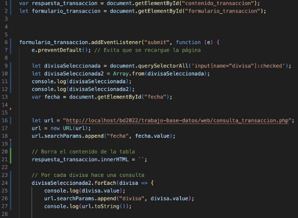

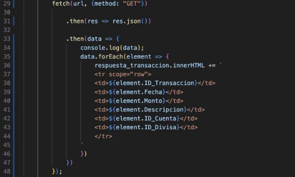

El php es una consulta get estándar salvo porque revisa que si no hay divisas seleccionadas hace la consulta teniendo en cuenta sólo la fecha, es decir, es como si hubiera seleccionado todas las divisas.

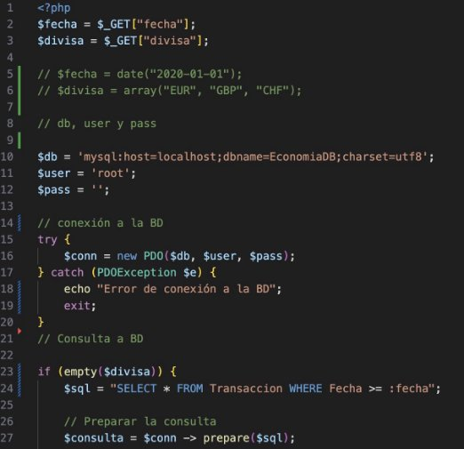

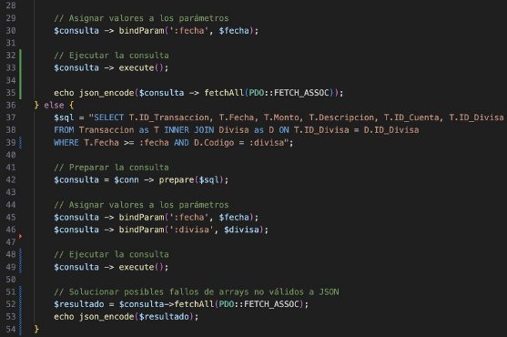

Insertar, eliminar datos

Voy a insertar clientes. Para ello inserto Nombre, Apellido y Fecha de nacimiento, además pongo ID\_Cuenta que tiene, si no añado ningún ID\_Cliente no se le asocia cuenta. La cuenta debe existir de antes.

Elimino clientes por el ID, si la cuenta que tenía asociada, se queda sin ningún cliente, elimino también la cuenta.

Problema surgido de array de arrays Tras la siguiente consulta ([consulta16](#_page12_x72.00_y708.91)):

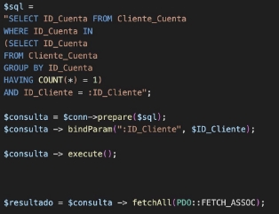

$resultado queda como una array de arrays, como se puede ver con un vardump:

(este vardump ha sido en un prueba.php y con unos datos que he añadido de prueba)

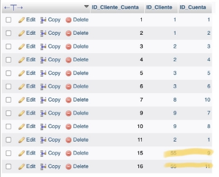

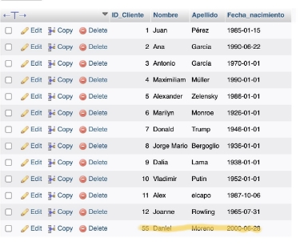

Lo he solucionado accediendo al elemento (INT) mediante la key del array “ID\_Cuenta”.

[ref1]: Aspose.Words.228433b0-d62f-43f1-b41e-947c2aea2d61.005.png
[ref2]: Aspose.Words.228433b0-d62f-43f1-b41e-947c2aea2d61.007.png
[ref3]: Aspose.Words.228433b0-d62f-43f1-b41e-947c2aea2d61.015.png
[ref4]: Aspose.Words.228433b0-d62f-43f1-b41e-947c2aea2d61.062.png
