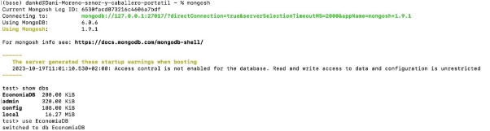
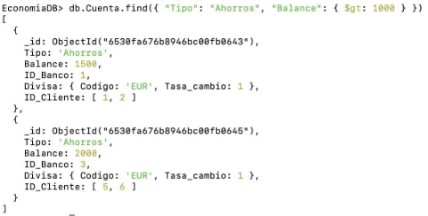
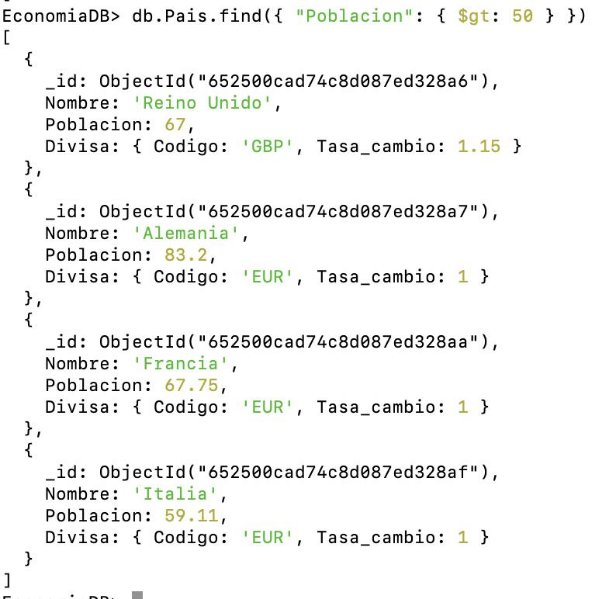
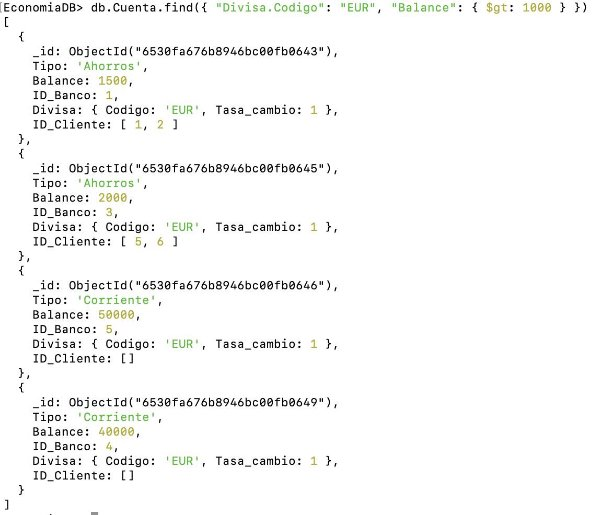
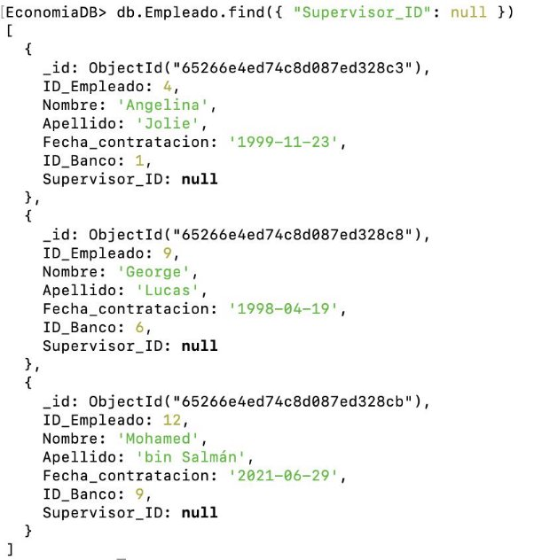
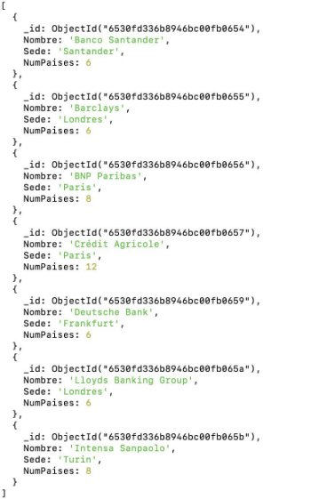

Consultoría de Bancos

[**Enunciado...............................................................................................................................2** ](#_page1_x72.00_y211.74)[Diseño conceptual................................................................................................................. 3** ](#_page2_x72.00_y72.00)[Diseño lógico..........................................................................................................................3** ](#_page2_x72.00_y482.93)[Entidades........................................................................................................................... 3 ](#_page2_x72.00_y535.37)[Relaciones N:M o N:M:P....................................................................................................4 ](#_page3_x72.00_y300.75)[**Diseño en MySQL Workbench..............................................................................................4** ](#_page4_x72.00_y379.08)[Microsoft Access................................................................................................................... 7** ](#_page9_x72.00_y592.18)[MongoDB................................................................................................................................ 7**](#_page10_x72.00_y374.28)

Enunciado

BankingConsulting quiere un base de datos en la que almacena la información relativa a bancos.

- Los bancos operan en países.
- Los países usan una única divisa.
- Una divisa puede ser compartida por varios países, por ejemplo el euro.
- Los clientes pueden tener varias cuentas bancarias y las cuentas bancarias pueden ser compartidas por varios clientes.
- Una cuenta está en un único banco.
- Se realizan transacciones en una divisa determinada
- Dichas transacciones tienen una única cuenta asociada
- Cuando dos clientes se mandan dinero se generan dos transacciones, una de recibir dinero (cantidad de dinero positiva) y otra de mandar dinero (cantidad de dinero negativa)
- Los clientes piden prestamos a los bancos.
- Un prestamo es pedido por una persona a un banco determinado.
- Los bancos tienen empleados. Estos empleados se dividen en supervisores y miembros de equipo. Un supervisor tiene varios miembros de equipo, pero un miembro de equipo es supervisado por un único supervisor.

De un país se desea guardar su Nombre y Población y un ID.

De los bancos su sede, nombre e ID.

De las divisas la tasa de cambio e ID.

De las cuentas sus balances, tipo (depósito o cuenta corriente) e iD.

De las transacciones la fecha, cantidad, descripción e ID.

De los prestamos la cantidad, fecha inicio, fecha vencimiento e ID.

De los empleados su nombre, apellido e ID.

Diseño conceptual

Diseño lógico

Entidades

Subrayado indica que dicho atributo(s) es(son) “Primary Key”

1. País (ID\_País, Nombre, Población,*ID\_Divisa*)
   1. FK: ID\_Divisa -> Divisa
1. Banco (ID\_Banco, Nombre, Sede)
1. Préstamo (ID\_Préstamo, Monto, Fecha\_inicio, Fecha\_vencimiento)
1. Cliente (ID\_Cliente, Nombre, Apellido, Fecha\_nacimiento)
1. Cuenta (ID\_Cuenta, Tipo, Balance, *ID\_Banco*)
   1. FK: ID\_Banco -> Banco
1. Transacción (ID\_Transacción, Fecha, Monto, Descripción,*ID\_Divisa*, *ID\_Cuenta*)
1. FK: ID\_Divisa -> Divisa
2. FK: ID\_Cuenta
7. Divisa (ID\_Divisa, Código, Tasa\_cambio)
7. Empleado (ID\_Empleado, Nombre, Apellido, *ID\_Banco*)
7. Supervisor(ID\_Supervisor, *ID\_Empleado*)

a. FK: ID\_Empleado -> Empleado

10\.Miembro\_Equipo(ID\_Miembro\_Equipo, *ID\_Empleado*, *ID\_Supervisor*)

1. FK: ID\_Empleado -> Empleado
1. FK: ID\_Supervisor -> Supervisor

En Divisa el código podría haber funcionado como “Primary Key” y en Supervisor y Miembro\_Equipo el ID\_Empleado podría haber funcionado como “Primary Key”, sin embargo, prefiero añadir nuevos IDs por guardar la consistencia con el resto de entidades.

Relaciones N:M o N:M:P

1. opera(ID\_País, ID\_Banco)
1. solicita (ID\_Banco,ID\_Prestamo,ID\_Cliente)
1. tiene(ID\_Cliente,ID\_Cuenta)

Normalización

Vamos a estudiar si el esquema lógico está en 3FN. Primero, usando la definición de clase de 1FN:

*“Una tabla relacional R está en primera forma normal (1FN) si NO contiene campos multivaluados (cada atributo 1 valor).”*

Como nuestro diseño no tiene campo multievaludados, concluimos que está en 1FN.

Preguntar por cuenta, en concreto tipos de cuenta se repite.

Para ver si está en 2FN es necesario que esté en 1FN y, además, que no exista dependencia transitiva entre campos no principales y claves candidatas.

- País (ID\_País, Nombre, Población,*ID\_Divisa*)
  - No hay atributos dependiente ID\_Pais (única clave candidata)
- Banco (ID\_Banco, Nombre, Sede)
  - No hay atributos parciales dependientes de la clave (ID\_Banco).
- Préstamo (ID\_Préstamo, Monto, Fecha\_inicio, Fecha\_vencimiento)
  - No hay atributos parciales dependientes de la clave (ID\_Préstamo)
- Cliente (ID\_Cliente, Nombre, Apellido, Fecha\_nacimiento)
- No hay atributos parciales dependientes de la clave (ID\_Cliente)
- Cuenta (ID\_Cuenta, Tipo, Balance, *ID\_Banco*)
  - No hay atributos parciales dependientes de la clave (ID\_Cuenta)
- Transacción (ID\_Transacción, Fecha, Monto, Descripción,*ID\_Divisa*, *ID\_Cuenta*)
  - No hay atributos parciales dependientes de la clave (ID\_Transacción)
- Divisa (ID\_Divisa, Código, Tasa\_cambio)
  - No hay atributos parciales dependientes de la claves candidatas (ID\_Divisa y Código)
- Empleado (ID\_Empleado, Nombre, Apellido, *ID\_Banco*)
  - no hay atributos parciales dependientes de la clave (ID\_Empleado)
- Supervisor(ID\_Supervisor, *ID\_Empleado*)
  - no hay atributos parciales dependientes de claves candidatas (ID\_Supervisor e ID\_Empleado)
- Miembro\_Equipo(ID\_Miembro\_Equipo, *ID\_Empleado*, *ID\_Supervisor*)
- no hay atributos parciales dependientes de claves candidatas (ID\_Miembro\_Equipo e ID\_Empleado)

Luego todas las tablas están en 2FN

Y no hay dependencias transitivas, luego, como es 2FN, también es 3FN.

Diseño en MySQL Workbench

Primero he generado los archivos SQL:

- [economiaDB.sql](https://github.com/danmorper/trabajo-base-datos/blob/main/BD/economia.sql) (diseño de tablas)
- [economia_insert.sql](https://github.com/danmorper/trabajo-base-datos/blob/main/BD/economia_insert.sql) (inserción de datos)

He usado la herramienta de “reverse engineering” para hacer el diseño lógico en MySQL Workbench.

*Poner imagen*

Consultas

Las consultas están en el archivo [queries.sql](https://github.com/danmorper/trabajo-base-datos/blob/main/BD/queries.sql)

1. clientes que hayan nacido después de 1960

SELECT \* FROM Cliente WHERE Fecha\_Nacimiento > '1960-12-31';![ref1]

2. clientes cuyos nombres empiecen por D

SELECT \* FROM Cliente WHERE Nombre LIKE 'D%';![ref2]

3. clientes que tengan más de 2 cuentas

SELECT Nombre

FROM Cliente WHERE ID\_Cliente IN

(SELECT ID\_Cliente FROM Cliente\_Cuenta GROUP BY ID\_Cliente

HAVING COUNT(ID\_Cuenta) > 1);

4. ids de los clientes que tengan cuenta en el Banco Bilbao y Deutsche Bank

SELECT ID\_Cliente

FROM Cliente\_Banco WHERE ID\_Banco IN (SELECT ID\_Banco FROM Banco WHERE Nombre IN ('Banco Bilbao', 'Deutsche Bank'));

5. id de los clientes cuya posicion neta (suma de balances de sus cuentas) sea negativa

SELECT ID\_Cliente, Nombre

FROM Cliente WHERE ID\_Cliente IN

(SELECT ID\_Cliente FROM Cuenta

INNER JOIN Cliente\_Cuenta ON Cuenta.ID\_Cuenta = Cliente\_Cuenta.ID\_Cuenta GROUP BY ID\_Cliente HAVING SUM(Balance) < 0);

6. ids de las transacciones que se hagan a una cuenta con divisa distinta a la propia de la transacción

SELECT ID\_Transaccion FROM Transaccion

INNER JOIN Cuenta ON Transaccion.ID\_Cuenta = Cuenta.ID\_Cuenta WHERE Transaccion.ID\_Divisa != Cuenta.ID\_Divisa;

7. cantidad a ingresar en la divisa de la cuenta de las transacciones que tienen una divisa distinta a la de la cuenta

SELECT Transaccion.Monto \* D1.Tasa\_cambio\*1/D2.Tasa\_cambio

FROM Transaccion

-- Join de la tabla de transacciones con la tabla de cuentas

INNER JOIN Cuenta ON Transaccion.ID\_Cuenta = Cuenta.ID\_Cuenta

-- Hago el JOIN para obtener Tasa de cambio de la moneda de la transacción INNER JOIN Divisa as D1 ON Transaccion.ID\_Divisa = D1.ID\_Divisa

-- Hago el JOIN para obtener Tasa de cambio de la moneda de la cuenta INNER JOIN Divisa as D2 ON Cuenta.ID\_Divisa = D2.ID\_Divisa

WHERE Transaccion.ID\_Divisa != Cuenta.ID\_Divisa;

8. Mostar el nombre de los clientes que tenga alguna cuenta con divisa distinta a euros

SELECT Nombre FROM Cliente WHERE ID\_Cliente IN

(SELECT ID\_Cliente FROM Cliente\_Cuenta WHERE ID\_Cuenta IN (SELECT ID\_Cuenta FROM Cuenta WHERE ID\_Divisa != 1));

9. Mostrar los paises que no tengan mas de 2 bancos

SELECT ID\_Pais FROM Banco\_Pais![ref3]

GROUP BY ID\_Pais HAVING COUNT(ID\_Banco) <= 2;

10. Mostrar las divisas que no tengan ninguna cuenta asociada

SELECT \* FROM Divisa![ref3]

WHERE ID\_Divisa NOT IN (SELECT ID\_Divisa FROM Cuenta);

11. Mostrar las divisas que se usen en menos de dos paises

SELECT ID\_Divisa FROM Pais![ref3]

GROUP BY ID\_Divisa HAVING COUNT(ID\_Pais) < 2;

AÑADIR FOTO

12. Mostrar los prestamos que tengan una durancion mayor a 10 años

SELECT \* FROM Prestamo WHERE DATEDIFF(Fecha\_fin, Fecha\_inicio) > 365\*10;

13. Mostrar los clientes que tengan un prestamo con una duracion mayor a 10 años

SELECT ID\_Cliente FROM Prestamo

WHERE DATEDIFF(Fecha\_fin, Fecha\_inicio) > 365\*10;

14. Mostrar los clientes que tengan un prestamo en un banco en el que no tienen ninguna cuenta

SELECT Cliente\_Prestamo\_Banco.ID\_Cliente FROM Cliente\_Prestamo\_Banco INNER JOIN Cliente\_Banco

ON Cliente\_Prestamo\_Banco.ID\_Cliente = Cliente\_Banco.ID\_Cliente

WHERE Cliente\_Prestamo\_Banco.ID\_Banco != Cliente\_Banco.ID\_Banco;

15. Mostrar las divisas con las que hay una cantidad transferida total equivalente a más de 500 euros

SELECT Transaccion.Monto\*Divisa.Tasa\_cambio, Transaccion.\* FROM Transaccion

INNER JOIN Divisa ON Transaccion.ID\_Divisa = Divisa.ID\_Divisa;

Microsoft Access

Vídeos útiles:

- [Como crear Bases de Datos en Access](https://youtu.be/5iopgBPbU50?si=QaTJGAq5wIXUtetA)
- [Como crear Formularios en Access](https://youtu.be/ynb7xkTyaSQ?si=pFkpatdQYotHsRn9)
- [FORMULARIOS con SUBFORMULARIOS 📰 Base de Datos en ACCESS (Pa…](https://www.youtube.com/watch?v=FDm-wKT4Kio)

Creación formularios con subformularios:

MongoDB

Primero hay que adaptar la parte del modelo entidad relación a colecciones (NoSQL). En la siguiente imagen se puede ver en verde la parte del modelo que voy a adaptar.

Paso de tablas a NoSQL

Banco

Colección con Nombre, Sede, ID (los genera automáticamente Mongo DB) y para conservar la relación entre País y Banco creo una colección con un array con los IDs de Pais.

Pais

Nombre, Poblacion y colección llamada Divisa con Código y Tasa de Cambio.

Cuenta

Divisa como subcolección y relación con Cliente mediante array de códigos.

Cliente

Empleado

Para adaptar la relación jerárquica vamos a poner un campo Supervisor\_ID, que será null para los supervisores (no son supervisados por nadie) pero cuando sea un miembro de un equipo (no supervisor) tendrá el ID del supervisor asignado.

Los archivos JSON anteriores se encuentran en github:

- [Banco.json](https://github.com/danmorper/trabajo-base-datos/blob/main/BD/MongoDB/Banco.json)
- [Cliente.json](https://github.com/danmorper/trabajo-base-datos/blob/main/BD/MongoDB/Cliente.json)
- [Cuenta.json](https://github.com/danmorper/trabajo-base-datos/blob/main/BD/MongoDB/Cuenta.json)
- [Empleado.json](https://github.com/danmorper/trabajo-base-datos/blob/main/BD/MongoDB/Empleado.json)
- [Pais.json](https://github.com/danmorper/trabajo-base-datos/blob/main/BD/MongoDB/Pais.json)

Consultas

Las consultas siguientes se encuentran en el siguiente fichero [consultas.txt](https://github.com/danmorper/trabajo-base-datos/blob/main/BD/MongoDB/consultas.txt)

1. Obtener todos los bancos con sede en "Londres"

EconomiaDB.Banco.find({ "Sede": "Londres" })![ref1]

2. Encontrar todas las cuentas de ahorro con un saldo mayor de 1000 euros db.Cuenta.find({ "Tipo": "Ahorros", "Balance": { $gt: 1000 } })![ref1]

3. Buscar empleados que trabajen en un banco con sede en "Londres" db.Empleado.find({ "ID\_Banco": { $in: [2, 7] } })![ref4]

4. Encontrar todos los clientes cuyo nombre sea "Juan" db.Cliente.find({ "Nombre": "Juan" })![ref4]

5. Obtener la población de todos los países con una población mayor de 50 millones de habitantes

db.Pais.find({ "Poblacion": { $gt: 50 } })![ref2]

6. Encontrar todas las cuentas en euros (EUR) con un saldo mayor de 1000 euros db.Cuenta.find({ "Divisa.Codigo": "EUR", "Balance": { $gt: 1000 } })![ref4]

7. Encontrar todos los empleados que no tienen supervisor, es decir, los supervisores. db.Empleado.find({ "Supervisor\_ID": null })![ref4]

8. Encontrar los bancos que operan en más de 5 países db.Banco.aggregate([

{

$project: {

Nombre: 1,

Sede: 1,

NumPaises: { $size: "$Pais" }

}

}, {

$match: {

NumPaises: { $gt: 5 }

}

}

]) ó

db.Banco.find({

$where: "this.Pais.length > 5" })

9. Obtener el nombre y apellido de los empleados que trabajan en el banco con ID 1 db.Empleado.find({ "ID\_Banco": 1 }, { "Nombre": 1, "Apellido": 1 })![ref4]

10. Encontrar las cuentas de ahorro con un saldo negativo db.Cuenta.find({ "Tipo": "Ahorros", "Balance": { $lt: 0 } })![ref1]

CORREGIR

11. Encontrar las cuentas de ahorro con un saldo negativo

db.Cuenta.find({ "Tipo": "Ahorros", "Balance": { $lt: 0 } })

12. Encuentra los tres bancos con el mayor número de sucursales (países en los que operan)

db.Banco.aggregate([

{ $project: { "Nombre": 1, "Numero\_Paises": { $size: "$Pais" } } }, { $sort: { "Numero\_Paises": -1 } },

{ $limit: 3 }

])

13. Encuentra el cliente más joven db.Cliente.aggregate([

{

$project: {

"Nombre": 1,

"Apellido": 1,

"Fecha\_nacimiento": { $toDate: "$Fecha\_nacimiento" },

"Edad": {

$floor: {

$divide: [

{ $subtract: [new Date(), { $toDate: "$Fecha\_nacimiento" }] }, 31536000000 // Milisegundos en un año

]

}

}

}

},

{ $sort: { "Edad": 1 } },

{ $limit: 1 }

])

14. Encuentra el saldo total de todas las cuentas en euros (EUR) para cada banco

db.Cuenta.aggregate([

{ $match: { "Divisa.Codigo": "EUR" } }, {

$group: {

\_id: "$ID\_Banco",

Saldo\_Total: { $sum: "$Balance" }

}

}

])

15. Encuentra la edad promedio de los empleados en el banco con ID 1

db.Empleado.aggregate([

{

$match: { "ID\_Banco": 1 }

},

{

$project: {

"Fecha\_contratacion": { $toDate: "$Fecha\_contratacion" }, "Edad": {

$floor: {

$divide: [

{ $subtract: [new Date(), { $toDate: "$Fecha\_contratacion" }] }, 31536000000 // Milisegundos en un año

]

}

}

}

}, {

$group: {

\_id: null,

EdadPromedio: { $avg: "$Edad" } }

}

])

16. Encuentra los clientes que no tienen cuentas en ningún banco.

db.Cliente.find({

"ID\_Cliente": { $nin: db.Cuenta.distinct("ID\_Cliente") } })

[ref1]: Aspose.Words.796175bd-0a00-4766-bece-ca2cada412db.002.png
[ref2]: Aspose.Words.796175bd-0a00-4766-bece-ca2cada412db.004.png
[ref3]: Aspose.Words.796175bd-0a00-4766-bece-ca2cada412db.018.png
[ref4]: Aspose.Words.796175bd-0a00-4766-bece-ca2cada412db.042.png
